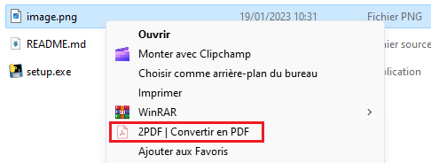
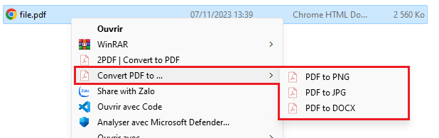

# 2PDF - Convertisseur de fichiers vers PDF

## Description
Ce projet propose un convertisseur de fichiers vers PDF en utilisant Python. Il prend en charge les fichiers au format docx, png, et jpg.  
  

## Installation
Exécutez le fichier setup.exe pour ajouter l'option "2PDF" au menu contextuel de l'explorateur de fichiers.
   - Le programme demandera les droits administrateurs pour modifier le registre.
   - Si vous préférez ne pas octroyer les droits, vous pouvez ajouter manuellement "2PDF" au registre Windows en exécutant le fichier "add_to_context_menu.reg".

## Utilisation
- Une fois installé, faites un clic droit sur le fichier que vous souhaitez convertir en PDF dans l'explorateur de fichiers.
- Sélectionnez l'option "2PDF | Convertir en PDF" dans le menu contextuel.
- ou bien sélectionnez l'option "2PDF | Convertir PDF en ..." dans le menu contextuel, afin d'afficher le volet d'option supplémentaire de conversion d'un PDF vers un fichier PNG, JPG ou DOCX

**Note:** Assurez-vous d'avoir les fichiers à convertir dans les formats pris en charge (docx, png, ou jpg).
